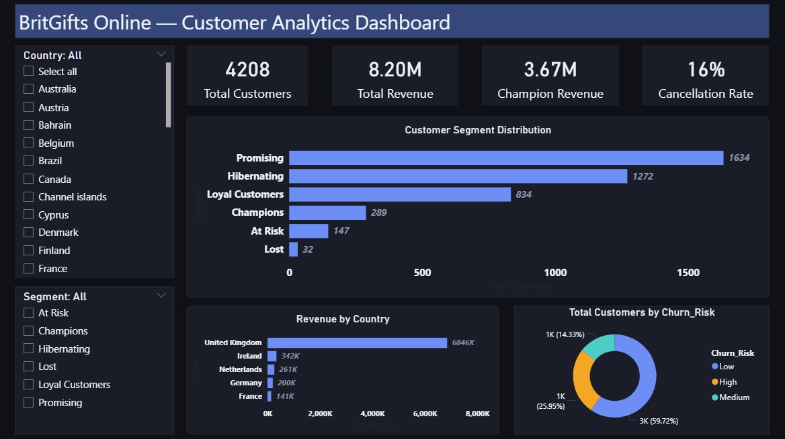
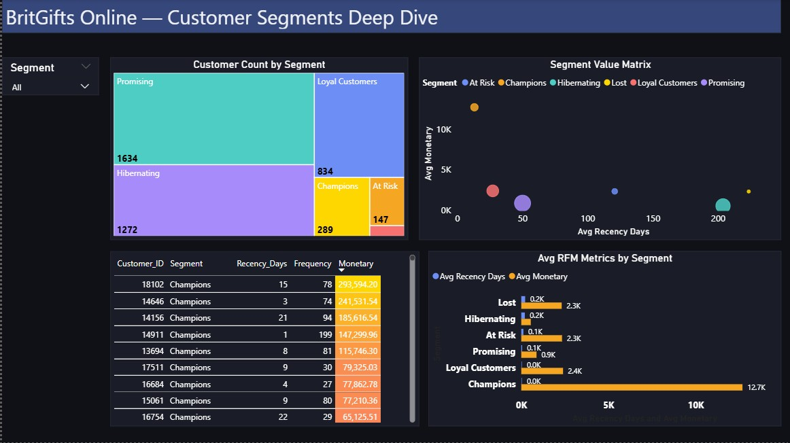

### Power BI Dashboard

#### Live Dashboard
[View Interactive Dashboard](YOUR_POWER_BI_PUBLISHED_LINK_HERE)

#### Dashboard Overview
Built an interactive 4-page executive dashboard connected directly 
to SQL Server — enabling real-time filtering and drill-through 
across all customer segments and churn indicators.

#### Pages

**Page 1 — Executive Overview**
High level KPIs — total customers, total revenue, cancellation rate, 
Champion revenue. Segment distribution bar chart, revenue by country, 
churn risk donut. Filterable by country and segment.

**Page 2 — Customer Segments**  
Segment treemap, RFM metrics comparison, segment value matrix scatter 
plot, customer detail table with conditional formatting.

**Page 3 — Cohort Retention**
Monthly retention heatmap with conditional color coding, Month 1 
retention trend line, cohort size vs retention scatter.

**Page 4 — Churn Risk**
Revenue at risk by segment stacked bar, churn risk distribution donut, 
High risk customer table sorted by monetary value.

#### Screenshots

### Technical Details
- **Data source:** SQL Server — analytics layer
- **Refresh:** Connected to live SQL Server database
- **DAX measures:** 12 custom measures including segment revenue, 
  churn rates, cohort retention calculations
- **Interactivity:** Cross-filtering, drill-through, slicers by 
  country and segment
